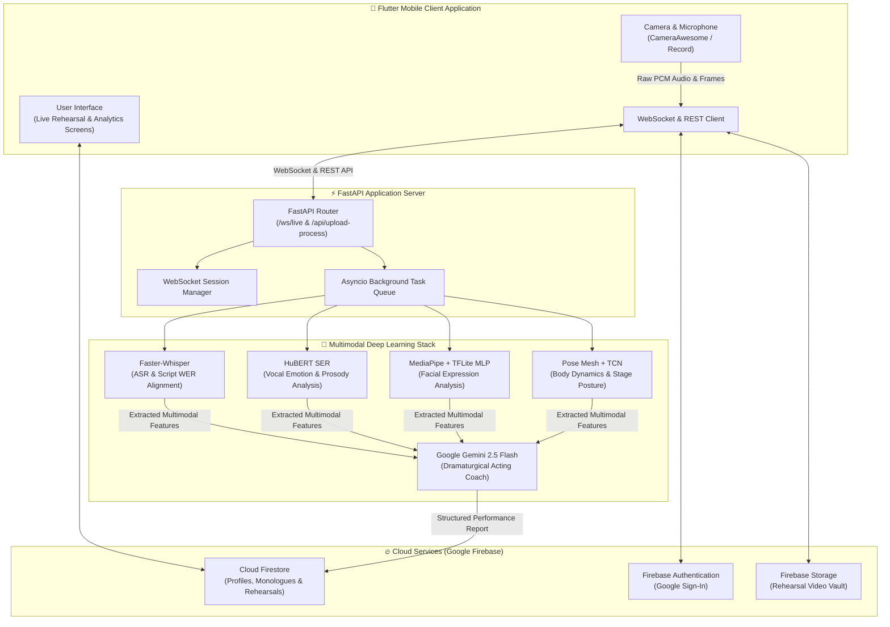

# Perform-AI
<div align="center">

# 🎭 PerformAI

### Multimodal AI-Powered Digital Acting Coach & Rehearsal Companion

🎓 **University of Turkish Aeronautical Association (THKU) — Capstone Project**  
*Department of Computer Engineering / Faculty of Engineering*

[](https://www.thk.edu.tr)
[](https://flutter.dev)
[](https://fastapi.tiangolo.com)
[](https://pytorch.org)
[](https://deepmind.google/technologies/gemini/)
[](https://firebase.google.com)
[](https://mediapipe.dev)

</div>

---

## 📌 Project Overview

**PerformAI** was developed as a graduation capstone project at the **University of Turkish Aeronautical Association** (*Türk Hava Kurumu Üniversitesi*), Faculty of Engineering. Engineered for stage actors, drama students, and performing artists, PerformAI is a cutting-edge **multimodal AI rehearsal and performance analytics platform** that enriches the theatrical rehearsal process through computer vision, audio/speech processing, and large language models (LLMs).

Traditional performing arts training often faces constraints in accessibility, geographic reach, and the availability of professional dramaturgical feedback. PerformAI addresses this challenge by simultaneously evaluating an actor's **facial expressions**, **body posture and gesture dynamics**, **vocal tone and prosody**, and **script adherence** in real time. These multimodal insights are synthesized through an intelligent AI acting coach to provide concrete, objective, and constructive feedback.

---

## ✨ Key Features

### 🔴 1. Real-Time Live Rehearsal Mode
- **Low-Latency Audio Streaming:** Continuous 16kHz mono PCM raw audio streaming with built-in digital gain boost and real-time amplitude calculation over high-speed WebSockets.
- **Live ASR Transcription & Script Tracking:** Real-time speech recognition decodes actor speech as they perform, synchronizing live utterances with the target monologue script.
- **Dynamic Waveform Visualizer:** Animated visual feedback showing vocal volume and live input activity during rehearsal.

### 📹 2. Video Upload & Offline Deep Processing
- Supports uploading full-length recorded rehearsal videos for comprehensive frame-by-frame multimodal analysis.
- Asynchronous GPU task scheduling processes complex deep learning models in the background and commits detailed analytics directly to the user's profile.

### 🧠 3. Multimodal Artificial Intelligence Pipeline
- **Facial Emotion Recognition (FER):** MediaPipe Face Landmarker tracks 478 3D facial landmarks; a specialized Multi-Layer Perceptron (MLP) neural network evaluates emotional authenticity and facial micro-expressions.
- **Body Expression & Pose Dynamics (BER):** MediaPipe Pose Landmarker combined with a 30-frame Temporal Convolutional Network (TCN) analyzes bodily openness, stage presence, movement energy, and posture alignment.
- **Speech Emotion Recognition (SER):** HuBERT-based acoustic feature extraction evaluates vocal inflection, emotional tone, pitch dynamics, and prosody.
- **Speech-to-Text & Script Fidelity (ASR):** Faster-Whisper provides word-level timestamped transcription, calculating Word Error Rate (WER) and timing consistency against canonical theatrical scripts.
- **AI Dramaturgical Acting Coach (LLM):** Powered by Google Gemini (`gemini-2.5-flash`), delivering expert-level dramaturgical critique tailored to character motivations, subtext, vocal clarity, and emotional coherence.

### 📚 4. Classical & Contemporary Monologue Library
- Pre-loaded repertoire containing canonical works by William Shakespeare (*Hamlet, Ophelia, Macbeth*), Samuel Beckett (*Waiting for Godot*), Anton Chekhov, and prominent Turkish theatrical playwrights.
- Monologues are organized with target emotional registers, difficulty ratings, estimated performance times, and specific acting rules.

### 📊 5. Comprehensive Performance Analytics & History
- Detailed breakdown metrics: Overall Acting Score, Emotional Alignment, Script Accuracy, and Vocal Dynamics.
- Interactive timeline charts, emotion distribution radar plots, pinpointed line-by-line critiques, and cloud persistence via Cloud Firestore.

---

## 🏛 System Architecture



---

## 🛠 Technology Stack

| Layer | Technologies |
|---|---|
| **Mobile Client (Frontend)** | Flutter 3.12+, Dart, CameraAwesome, Record, WebSocket Channel, Google Fonts |
| **Server Engine (Backend)** | Python 3.12, FastAPI, Uvicorn, WebSockets, Asyncio |
| **Deep Learning & Computer Vision** | PyTorch (CUDA 12.4), Transformers, Faster-Whisper, HuBERT, MediaPipe, TFLite |
| **Large Language Model (LLM)** | Google Gemini 2.5 Flash (Google GenAI SDK) |
| **Cloud & Database** | Firebase Authentication, Cloud Firestore, Firebase Storage |

---

## 📋 System Requirements

The minimum system, hardware, and environment prerequisites to compile and run PerformAI:

### 1. Client (Flutter) Requirements
- **Flutter SDK:** `^3.12.0` or higher
- **Dart SDK:** Bundled with Flutter
- **Development Environment:** Android Studio, VS Code, or Xcode (for macOS)
- **Target Device:** Physical Android or iOS device (or camera-enabled emulator) with microphone permissions

### 2. Server (FastAPI Backend) Requirements
- **Python:** Python `3.10`, `3.11`, or `3.12` (Python 3.12 recommended)
- **System Libraries:**
  - `ffmpeg` *(Required for video audio extraction and chunking)*
  - `libsndfile1`, `libsndfile1-dev` *(Audio I/O processing)*
  - `libgl1`, `libglib2.0-0` *(MediaPipe & OpenCV graphics dependencies)*
- **Hardware (GPU Recommended):**
  - NVIDIA GPU with minimum 6 GB VRAM (CUDA 12.x) is recommended for real-time speech and video inference.
  - Can operate on CPU, though inference latency will be higher.

### 3. Service Accounts & API Credentials
- **Google Gemini API Key:** Obtain an API key from [Google AI Studio](https://aistudio.google.com/).
- **Google Firebase Project:**
  - Firebase Authentication enabled (with Google Sign-In)
  - Cloud Firestore Database
  - Firebase Storage bucket

---

## 🚀 Installation & Setup Guide

### Step 1: Clone the Repository
```bash
git clone https://github.com/your-username/perform_ai.git
cd perform_ai
```

---

### Step 2: Backend (FastAPI) Setup

1. **Create and Activate a Python Virtual Environment:**
   ```bash
   cd backend
   python -m venv venv

   # On Linux / macOS:
   source venv/bin/activate

   # On Windows (PowerShell):
   .\venv\Scripts\Activate.ps1
   ```

2. **Install Required Dependencies:**
   - **For GPU Acceleration (CUDA 12.4):**
     ```bash
     pip install --upgrade pip setuptools wheel
     pip install torch torchaudio --index-url https://download.pytorch.org/whl/cu124
     pip install -r requirements_gpu.txt
     ```
   - **For CPU-Only Environments:**
     ```bash
     pip install -r requirements.txt
     ```

3. **Configure Environment Variables:**
   Copy the example environment template in `backend`:
   ```bash
   cp .env.example .env
   ```
   Open `.env` and configure your Gemini API Key and server preferences:
   ```env
   GEMINI_API_KEY=your_gemini_api_key_here
   HOST=0.0.0.0
   PORT=8000
   ```

4. **Provide Firebase Admin Credentials:**
   - Navigate to Firebase Console -> Project Settings -> Service Accounts.
   - Click **Generate New Private Key** (`.json`).
   - Rename and place the downloaded file at: `backend/config/serviceAccountKey.json`  
     *(Refer to `backend/config/serviceAccountKey.json.example` for the required format)*.

5. **Start the FastAPI Backend Server:**
   ```bash
   # From the project root directory:
   python -m backend.main
   ```
   The server will start listening at `http://0.0.0.0:8000`.

---

### Step 3: Client (Flutter) Setup

1. **Install Flutter Dependencies:**
   From the project root directory, run:
   ```bash
   flutter pub get
   ```

2. **Configure Firebase Client Files:**
   - Place your project's `google-services.json` inside `android/app/`.
   - Place `GoogleService-Info.plist` inside `ios/Runner/` (for iOS).
   - Alternatively, configure via the official FlutterFire CLI:
     ```bash
     flutterfire configure
     ```

3. **Set Backend Host IP Address:**
   In [`lib/services/ai/websocket_service.dart`](file:///c:/Users/Excalibur/Desktop/FlutterApps/perform_ai/lib/services/ai/websocket_service.dart), ensure the backend host matches your server address:
   ```dart
   // For Android Emulator (default host mapping): '10.0.2.2:8000'
   // For Physical Device on Local Wi-Fi: '192.168.1.X:8000'
   // For Cloud Production Host: 'api.yourdomain.com'
   ```

4. **Run the Flutter Application:**
   ```bash
   flutter run
   ```

---

### Step 4: (Optional) Seed the Monologue Database

To populate your Firestore database with the pre-configured collection of theatrical monologues, character rules, and reference imagery, execute the automated seeding utility:
```bash
python scripts/seed_firestore.py
```

---

### Step 5: (Optional) Cloud GPU Deployment (RunPod / Vast.ai)

For fast single-command provisioning on remote Ubuntu GPU cloud instances (RunPod, Vast.ai, AWS, Lambda Labs), a complete setup script is provided:
```bash
chmod +x backend/setup_server.sh
./backend/setup_server.sh
```

---

## 📂 Project Directory Structure

```plaintext
perform_ai/
├── android/                    # Android native configuration & manifests
├── ios/                        # iOS native configuration & assets
├── assets/                     # Application models and visual assets
│   ├── images/                 # Brand logo and artwork
│   └── models/                 # Offline ML model bundles
│       ├── ber/                # Body Expression Recognition models & TCN
│       ├── fer/                # Facial Emotion Recognition models & MLP
│       ├── face_landmarker.task
│       └── pose_landmarker_full.task
├── backend/                    # Python FastAPI application server
│   ├── config/                 # Firebase & backend configurations
│   │   ├── firebase_config.py
│   │   └── serviceAccountKey.json.example
│   ├── models_manager/         # Model orchestrators (Whisper, HuBERT, Gemini, FER)
│   ├── services/               # Async video pipeline & rehearsal loops
│   ├── .env.example            # Environment variables template
│   ├── app.py                  # FastAPI core app definition & lifespan hooks
│   ├── main.py                 # Backend entrypoint executable
│   ├── routes.py               # REST API endpoints & WebSocket handler
│   ├── requirements.txt        # CPU / Base package dependencies
│   ├── requirements_gpu.txt    # CUDA-accelerated package dependencies
│   └── setup_server.sh         # Automated Linux / Cloud GPU setup script
├── lib/                        # Flutter Dart source code
│   ├── screens/                # UI screens (Live Rehearsal, History, Report, Home)
│   ├── services/               # Client service implementations
│   │   ├── ai/                 # WebSocket client, audio stream controller, feature extractor
│   │   ├── auth_service.dart   # Google Sign-In & Firebase Auth
│   │   ├── firestore_service.dart
│   │   └── storage_service.dart
│   ├── theme/                  # Design tokens, color palette, and typography
│   ├── firebase_options.dart   # Firebase multi-platform configuration
│   └── main.dart               # Flutter application entrypoint
├── scripts/                    # Database seeding & utility tools
│   ├── data/                   # Theatrical monologue JSON archive
│   └── seed_firestore.py       # Firestore database seeding script
├── test/                       # Unit and widget test suite
├── firestore.rules             # Cloud Firestore security rules
├── storage.rules               # Firebase Storage security rules
├── pubspec.yaml                # Flutter project specifications and dependencies
└── README.md                   # Project documentation
```

---

## 🔒 Security & Data Privacy

- **Credential Sanitation:** No private keys (`serviceAccountKey.json`, `.env`, keystores, or raw API tokens) are tracked in version control. The repository `.gitignore` strictly guards against accidental credential exposure.
- **User Data Isolation:** Cloud Firestore and Firebase Storage security rules enforce strict user-level authorization policies (`request.auth.uid == userId`), ensuring rehearsals and evaluation reports remain strictly confidential to the owning performer.

---

## 🎓 Academic Context

This project was conceived, designed, and implemented as an undergraduate **Capstone Graduation Project** at the **University of Turkish Aeronautical Association** (*Türk Hava Kurumu Üniversitesi*), Faculty of Engineering, Department of Computer Engineering. The primary research objective is the interdisciplinary convergence of deep learning, computer vision, acoustic prosody modeling, and stage performance pedagogy.

---

## 📄 License

This software is developed for academic, educational, and experimental research purposes. For terms and conditions regarding usage and redistribution, please refer to the [LICENSE](LICENSE) file.
